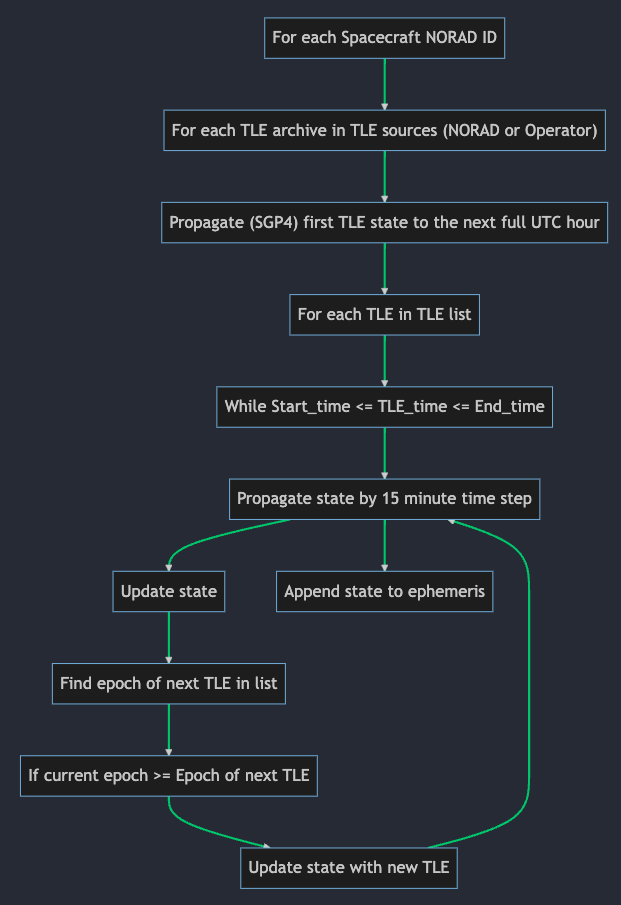

# MegaConstellationSSA
Code repository accompanying the paper: On the Limits of Current Practices in Uncooperative Space Surveillance: Analysis of Mega-Constellation Data Time-Series

## Abstract:
The proliferation of objects in Low Earth Orbit (LEO) poses a major challenge to operating mega-constellations. The risk of collisions between resident space objects and operational satellites is rapidly increasing, thus promoting the importance of Space Traffic Management (STM). To improve STM, accurate determination of object orbits in satellite neighbourhoods is crucial.

The continued, critical evaluation of uncooperative tracking practices is imperative to successful STM. In this study, we compare the state-of-practice, relative to STM requirements to identify shortcomings in current space situational awareness (SSA) data quality (precision, accuracy, timeliness).
    As of yet, SSA systems fail to provide data of adequate quality to ensure safe mega-constellation operations in LEO. The paucity of publicly accessible reference objects used to assess SSA data quality limits further understanding. Although uncertainty characterization is a prominent topic in the SSA literature, accuracy remains underexplored. This study aims to bring a geodesist’s perspective to SSA: one that emphasizes the role of absolute accuracy.
    
Firstly, the study uses high-precision operator ephemerides to benchmark Two-Line-Element (TLE) data based on cooperative and uncooperative tracking data for a subset of the Starlink constellation. We find that TLE data based on uncooperative tracking has a mean positional error of 1.17-2km relative to operator ephemeris data, and that TLE data based on cooperative data is approximately 60\% more accurate (0.7-0.95km).
    
Following this, a time-series analysis of two sources of TLE data (one based on cooperative tracking and one based on uncooperative tracking) for the Starlink and OneWeb mega-constellations over around 400 days revealed large inconsistencies in the data. The two sources of orbit solutions displayed launch-specific and constellation-specific variations. The mean absolute positional differences between the two TLE sets were measured in kilometres (2.7km for Starlink and 1.65km for OneWeb), with variances approximately an order of magnitude greater than the mean (13.2 km for Starlink and 17.3km for OneWeb).
A Fourier analysis was used to identify a once-per-rev signal within the time series. This signal is explained by a systematic relation between geographical position (latitude and longitude) and discrepancies that fall within one standard deviation of the mean. Larger errors (greater than or equal to 2 standard deviations from the mean) do not exhibit any structure. The greatest direction of mean difference between the two data sources is the along-track, followed by height and cross-track. The relationship between the TLE latency and accuracy is explored, uncovering constellation-specific patterns and behaviours. The role of measurement quality and force modelling in the observed differences are discussed. We discuss the impact of the accuracy of the orbit solutions on state uncertainty and thus prediction error.
    
Finally, we compare the results to existing research on the topic and assess how they align with current and future needs in SSA data. A critical evaluation of the literature's methods for assessing SSA data accuracy reveals their insufficiency. Consequently, we propose that the SSA community develops a set of internationally recognized reference orbits across LEO. This would enable a robust, comprehensive characterization of any SSA data source in the orbital neighbourhoods that are projected to come under increasing congestion in the near future.
    
Using TLEs as a case study, this research bolsters the case for transparency surrounding SSA data quality. The large inconsistencies, launch-specific and constellation-specific spatio-temporal variations found in the data point to poorly characterized data of heterogeneous quality. At present, we find that TLE data require a 3- to 5-fold improvement in accuracy to meet the requirements for use in STM that are outlined in the literature.
    
Overall, this study leverages the wide spatio-temporal distribution of TLE data as it pertains to mega-constellations to quantify the gap between required and provided accuracy in positional data provided by SSA systems.

## Instructions for use
1. Clone the repository
2. Install the requirements using the megeaconst_env.yml file:
``` bash
conda env create -f megaconst_env.yml
```
3. Activate the environment:
``` bash
 conda activate megaconst_env
```
4. If you wish to redownload the TLE data: Create a file called SLTrack.ini and put it in the root directory of the repository. The file should contain your Space-track.org username and password in the following format:
``` bash
[configuration]
username = your_email@email.com
password = YourPassword
```
5. Ensure that this file is in the .gitignore file so that it is not uploaded to the repository (it should be by default)
6. Run the code in main.py for the full analysis

## Information
The following code reads in all TLEs available for each spacecraft and propagates them using the SGP4 propagator. The orbit state is continuously updated with new TLEs as these become available. The outline of the algorithm that performs this is as follows:


## Data
- The data for the SUP_TLEs and NORAD_TLEs are already provided to save time. 
    If you wish to re-download the data yourself, you can do so for the NORAD TLEs by running the getdata.py script. Note that there is currently no way of downloading SUP_TLE data programatically so you will have to do this manually from celestrak.org.
- The NORAD IDs of the satellites selected for this study are provided in external/selected_satellites.json
- The TLE_analysis files are around ~1GB in size so I have not added these to the repo. You will have to run the NORAD_vs_SUP_TLE_analysis() function to generate these. This will only take a couple of minutes typically.

## Issues
If you have any issues with the code, please raise an issue on this repository and I will try to get back to you as soon as possible.

## Envs
If you make changes to your environment and you wish to save these to the envionment file:
``` bash
conda env export > megaconst_env.yml
```
