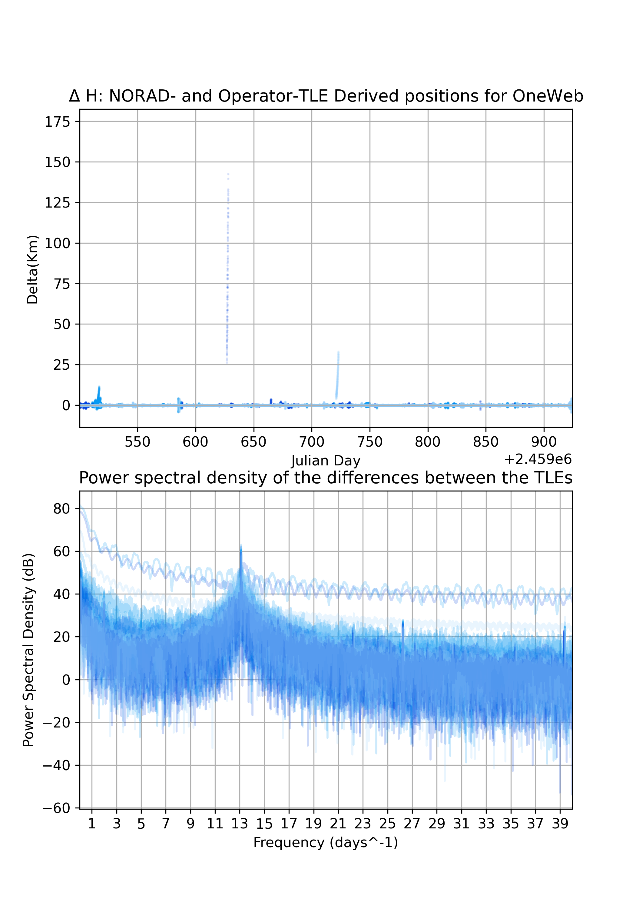
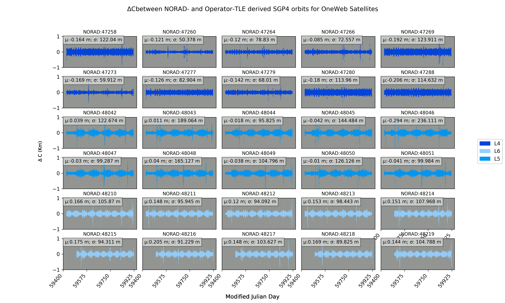

# MegaConstellationSSA
Code repository accompanying the paper: _C.Constant, S.Bhattarai, M.Ziebart_ "On the Limits of Current Practices in Uncooperative Space Surveillance: Analysis of Mega-Constellation Data Time-Series"(2023) 

## Abstract:
The rapid increase of objects in Low Earth Orbit (LEO) has underscored the need for advanced Space Traffic Management (STM) practices. The effectiveness of STM largely depends on accurately determining object orbits in densely populated satellite neighborhoods. In this light, our study aims to bridge the gap between current practices and STM requirements by emphasizing the imperative role of Space Situational Awareness (SSA) data quality, especially its precision, accuracy, and timeliness.

To this end, we present this GitHub repository which features the code used in our research. The code evaluates Two-Line-Element (TLE) data, based on both cooperative and uncooperative tracking for a subset of the Starlink constellation, against high-precision operator ephemerides. Our findings indicate that uncooperative tracking data has a mean positional error of 1.17-2km, while cooperative tracking data is approximately 60% more accurate.
Our time-series analysis of TLE data for Starlink and OneWeb mega-constellations uncovers significant discrepancies, further underscoring the need for transparency and improvement in SSA data quality.

## Collaboration statement:

We welcome developers, researchers, and SSA practitioners to explore this repository, review our approach, and contribute to this essential field. Feel free to raise issues, suggest improvements, or submit pull requests. Let's collaborate to ensure the safe and sustainable utilization of our shared space environment. Your expertise and contributions are not only valued but vital in bridging the gap between the required and actual positional data accuracy in SSA systems.

## Instructions for use
1. Clone the repository
2. Install the requirements using the megeaconst_env.yml file:
``` bash
conda env create -f megaconst_env.yml
```
3. Activate the environment:
``` bash
 conda activate megaconst_env
```
4. If you wish to redownload the TLE data: Create a file called SLTrack.ini and put it in the root directory of the repository. The file should contain your Space-track.org username and password in the following format:
``` bash
[configuration]
username = your_email@email.com
password = YourPassword
```
5. Ensure that SLTrack.ini is in the .gitignore file so that it is not uploaded to the repository (it should be by default)

6. Simply run main.py for the full analysis to run from start to finish.

## Information:

__SGP4 Update Algorithm:__
The state vectors for each spacecraft orbit are continuously updated with new TLEs as these become available. The outline of the algorithm that performs this is as follows:


## Data
- The data for the SUP_TLEs and NORAD_TLEs are already provided to save time. 
    If you wish to re-download the data yourself, you can do so for the NORAD TLEs by running the getdata.py script. Note that there is currently no way of downloading SUP_TLE data programatically so you will have to do this manually from celestrak.org.
- The NORAD IDs of the satellites selected for this study are provided in external/selected_satellites.json
- The TLE_analysis files are around ~1GB in size so I have not added these to the repo. You will have to run the NORAD_vs_SUP_TLE_analysis() function to generate these. This will only take a couple of minutes typically.

## Outputs:
The following repo will enable you to replicate all figures in the paper and a number of others that were not included for brevity.

__altitude time series plots__


__Fourier analysis of the difference time-series__



__Cross-track/along-track/height/3D difference time-series subplots__


__Launch statistics__
Summary statistics of the analysis are generated and can be found in the _"output/launch_specific/launch_summary_stats.csv"_ folder.

## Issues
If you have any issues with the code, please raise an issue on this repository and I will try to get back to you as soon as possible.

## Envs
If you make changes to your environment and you wish to save these to the envionment file:
``` bash
conda env export > megaconst_env.yml
```
